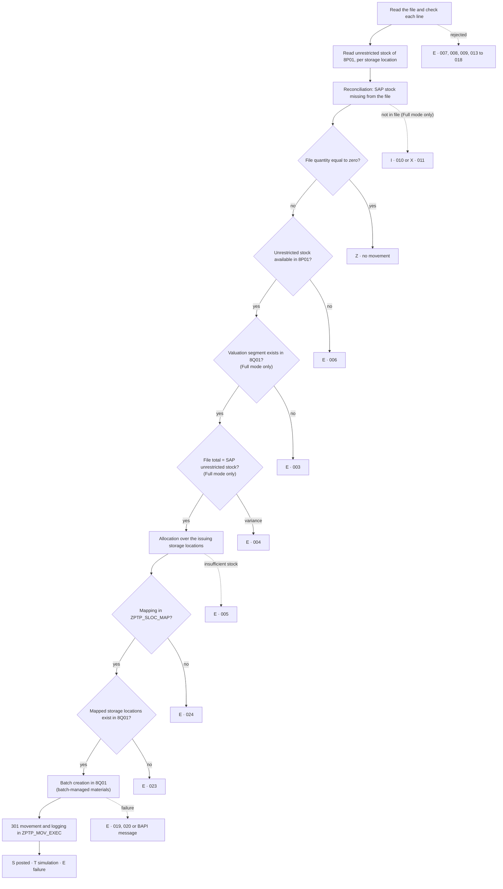

# ZPTP_SPLIT_VAL_MIG — Functional Specification and User Guide

2026-10-02 · program v0.6 (aligned on the source)

## 1. Purpose and scope

Program ZPTP_SPLIT_VAL_MIG transfers unrestricted stock from source plant 8P01 to the new plant 8Q01, where split valuation is active, with movement type 301 (one-step plant-to-plant transfer). The input file provides the material / batch / valuation type mapping and the quantities.

**What the program does:**

- reads the unrestricted stock of the source plant, per storage location;
- reconciles that stock with the input file and checks the data (valuation segment, quantities, units, batches);
- creates missing batches in the target plant, with the attributes of the source batch;
- posts one 301 movement per input file line, with the target valuation type;
- logs every processed line in a log table and displays the result in an ALV list.

**Materials handled:** batch-managed and non-batch-managed materials.

**Out of scope:**

- quality-inspection stock, blocked stock and special stocks: only unrestricted stock is read;
- batch classification: class characteristics are not copied;
- company-code-level valuation: the program assumes valuation at plant level.

**Intended use:** one-off migration, run by the migration team, always in simulation first and then for real.

**Assumptions:**

- every storage location of the source plant holding stock has an entry in the mapping table ZPTP_SLOC_MAP, pointing to a storage location that exists in the target plant;
- file quantities are in the material's base unit of measure;
- a batch carries a single valuation type.

## 2. Processing flow

Each input file line goes through a sequence of checks. At the first failed check, the line stops with a status and a message, and nothing is posted for it. The other lines carry on.



### 2.1 Preparation (once per run)

1. **File reading.** Each line is split on the separator. An unusable line is rejected and logged with status E: layout error or material number that cannot be converted (009), non-numeric quantity (007), negative quantity (008) or unknown unit (017).
2. **Line checks.** The program checks the unit against the base unit (018), a single valuation type per batch (016) and the consistency of NO_BATCH declarations with the material master (013, 014, 015). Placeholder batch values are reduced to blank (warning 012).
3. **Aggregation.** File quantities are summed per material + batch for the quantity check.
4. **SAP stock reading.** Unrestricted stock of the source plant per storage location: MCHB-CLABS for batch-managed materials, MARD-LABST for the others. A material is batch-managed when MARC-XCHPF of the source plant or MARA-XCHPF is set.
5. **Reverse reconciliation.** A material/batch in SAP stock but missing from the file is reported: status I (010) if a valuation segment already exists in the target plant, status X (011) otherwise. It is not transferred. This check runs in Full Validation mode only and is skipped on an error-reprocessing run. Stock of a material or batch already blocked by a line check is not reported a second time.

### 2.2 Processing of each line

1. **Zero quantity**: status Z, no movement.
2. **Unrestricted stock**: no unrestricted stock for the material/batch in the source plant gives status E (006).
3. **Valuation segment** (Full mode only): the file's valuation type must exist in the target plant (MBEW), otherwise E (003).
4. **Quantity** (Full mode only): the file total per material + batch must equal the SAP unrestricted stock, to three decimals, otherwise E (004).
5. **Storage location allocation**: the quantity is taken from the storage locations holding the stock, largest first. If the remaining stock does not cover the line, E (005); no partial issue is made.
6. **Receiving storage locations**: each issuing storage location is mapped to a receiving storage location through table ZPTP_SLOC_MAP (source plant + storage location → target plant + storage location). No entry: E (024). Mapped storage location missing in the target plant (T001L): E (023).
7. **Batch creation** (batch-managed materials): if the batch does not exist in the target plant, it is created with the attributes of the source batch and the target valuation type. A batch that already exists with another valuation type blocks the line (019). In simulation, the batch is not created.
8. **301 movement**: one material document per input file line, one item per issuing storage location, posting date = P_BUDAT. The document and its log rows are committed together.

Checks 5 and 6 run before batch creation, so no batch is created for a line that cannot be posted.

### 2.3 Execution modes

| Mode | Parameter | Checks 3 and 4, reverse reconciliation | Use |
| --- | --- | --- | --- |
| Full Validation | P_FULL (default) | run | standard case: only fully valid lines are transferred |
| Direct Transfer | P_DIR | skipped | materials whose split valuation is not yet active in the target plant; the 301 carries the valuation type only if the material is split-valuated in the target plant |

In both modes, the line checks, the unrestricted stock check, the allocation, the storage location check and batch creation apply.

### 2.4 Simulation and real run

In simulation (P_TEST checked, the default), the program runs every check and calls BAPI_GOODSMVT_CREATE in test mode followed by a rollback: SAP checks the movement without writing any stock. Valid lines are logged with status T and the material document column shows SIMULATED. Batches are not created; the source batch is still read, so an unreadable source batch (020) shows up in simulation. To post for real, uncheck P_TEST.

## 3. Selection screen

The screen is titled **STOCKS & BATCHES MIGRATION PROGRAM** and has 17 parameters in four blocks. Each parameter is labelled *label (technical name)*, for example *Source plant (P_WSRC)*. Consistency checks run only on execution (F8, background job, print), not on every change on the screen. When the deletion option P_DEL is checked, only the RUN_ID is checked.

### 3.1 Block "Organizational data"

| Parameter | Label | Mandatory | Default | Meaning and behaviour |
| --- | --- | --- | --- | --- |
| P_WSRC | Source plant | yes | 8P01 | Issuing plant whose unrestricted stock is read and transferred. Must exist in T001W and differ from the target plant. |
| P_WDST | Target plant | yes | 8Q01 | Receiving plant, where split valuation is active. Must exist in T001W. Valuation segments, batches and storage locations are checked in this plant. |
| P_LGDST | Receiving SLoc | no | blank | Receiving storage location, checked against T001L for the target plant when filled. **Not used for posting**: each item is received in the storage location mapped in ZPTP_SLOC_MAP. |
| S_MATNR | Material | no | blank | Restricts processing to some materials, both in the stock read and in the file. |
| S_CHARG | Batch | no | blank | Restricts processing to some batches, in the stock and in the file. |
| S_MTART | Material type | no | blank | Restricts processing to some material types (MARA-MTART). A material excluded by this filter is skipped without a message. |
| P_BUDAT | Posting date | yes on execution | today | Posting date of the 301 movements. Also checked in background. |

With any of the three filters S_MATNR, S_CHARG or S_MTART, the "SAP stock missing from the file" reconciliation only covers the filtered scope. For a complete reconciliation, run without filters.

### 3.2 Block "Input file"

| Parameter | Label | Mandatory | Default | Meaning and behaviour |
| --- | --- | --- | --- | --- |
| P_SRV | Application server | exclusive choice | checked | The file is read on the application server. The only possible choice in background. |
| P_LOC | Local file | exclusive choice | — | The file is uploaded from the workstation (GUI). Requires a dialog run. |
| P_FILE | Input file path | yes | blank | Full path of the file. F4 help opens the server or workstation file browser, depending on the choice above. The program checks that the file exists and is readable before starting. |
| P_SEP | Field separator | yes | ; | Column separator character of the file. |

### 3.3 Block "Run control"

| Parameter | Label | Mandatory | Default | Meaning and behaviour |
| --- | --- | --- | --- | --- |
| P_RUNID | Run ID, blank=new | no | blank | Run identifier. Blank: a new identifier HBM + date + time is generated. Filled: the run is attached to this RUN_ID with the next sequence (001, 002, …). Required with P_REPRC and P_DEL. |
| P_REPRC | Reprocess errors | no | unchecked | Reprocesses only the lines with status E in the previous sequence of the RUN_ID. Requires a RUN_ID that exists in ZPTP_MOV_EXEC. |
| P_FULL | Full validation | exclusive choice | checked | Standard mode: all checks apply (see 2.3). |
| P_DIR | Direct transfer | exclusive choice | — | Skips the valuation segment check, the quantity check and the reverse reconciliation (see 2.3). |
| P_TEST | Simulation | no | checked | Checked: simulation, no stock posting and no batch creation. Unchecked: real run. |

### 3.4 Block "Maintenance"

| Parameter | Label | Mandatory | Default | Meaning and behaviour |
| --- | --- | --- | --- | --- |
| P_DEL | Delete run ID | no | unchecked | Deletes the rows of the entered RUN_ID from both log tables, after confirmation. No other processing is run. See section 6. |

## 4. Input file format

The input file is a flat text file with one line per material / batch / valuation type combination and five columns in a fixed order.

### 4.1 Columns

| Position | Column | Mandatory | Content and rules |
| --- | --- | --- | --- |
| 1 | MATNR | yes | Material number, with or without leading zeros (standard SAP conversion). Blank: line rejected (009). |
| 2 | CHARG | no | Batch number for a batch-managed material. For a non-batch-managed material: blank or NO_BATCH (see 4.3). |
| 3 | BWTAR | yes | Target valuation type in plant 8Q01. Blank: line rejected (009). |
| 4 | QUANTITY | yes | Quantity to transfer, in the material's base unit. Non-numeric: rejected (007). Negative: rejected (008). Zero: no movement (status Z). |
| 5 | UOM | no | Unit of measure. Must be the material's base unit (MARA-MEINS). Unknown: rejected (017). Different from the base unit: rejected (018). Blank: the base unit is used. |

Extra columns after the fifth are ignored. A line with fewer than five columns is rejected (009), except the first line, which is then taken as a header and skipped.

**Not in the file:** storage location, plants, movement type and posting date. The issuing storage locations come from SAP stock, the plants and the date from the selection screen, and the movement is always a 301.

### 4.2 Format rules

| Property | Rule |
| --- | --- |
| Separator | The one in P_SEP, default `;`. It must not appear inside a value: no quoting or escaping. |
| Header line | Optional. The first line is skipped when its 4th column is not numeric or when it has fewer than five columns. |
| Empty lines | Ignored anywhere in the file. |
| Decimals | Point or comma accepted. No thousands separator. |
| Blanks and case | Blanks around values are removed. Batch, valuation type and unit are converted to upper case. |
| Encoding | Default code page of the application server, no BOM. |
| Line endings | Those of the application server: transfer the file in text mode, otherwise a stray carriage return ends up in the unit. |

### 4.3 Batch column

| Value | Interpretation | Message |
| --- | --- | --- |
| Batch number | Batch-managed material: batch to transfer, created in the target plant if needed. | — |
| NO_BATCH (or NOBATCH, NO-BATCH, NO BATCH, case-insensitive) | Declaration: the material is batch-managed neither in the source plant nor in the target plant. No batch is created; the 301 carries the valuation type only. | none; blocked if the material master contradicts the declaration (013, 014, 015) |
| Blank | Non-batch-managed material: transferred without batch. Unlike NO_BATCH, a blank is not checked against the material master; on a batch-managed material it finds no stock. | none; 006 on a batch-managed material |
| N/A, NA, NONE, NULL, -, --, #, . | Placeholder value, reduced to blank. | warning 012 |
| Any other value on a non-batch-managed material | Reduced to blank. | warning 012 |

A batch can carry only one valuation type. A batch that appears on several lines with different valuation types is rejected (016); lines with quantity zero are not counted.

### 4.4 Example

```csv
MATNR;CHARG;BWTAR;QUANTITY;UOM
100234;0000004711;VT01;150,000;KG
100234;0000004712;VT02;80,000;KG
200987;NO_BATCH;VT01;1250,000;PC
300555;;VT02;0,000;L
```

- Line 1: header, skipped.
- Lines 2 and 3: two batches of the same material, each with its own valuation type.
- Line 4: non-batch-managed material, declared NO_BATCH.
- Line 5: blank batch and zero quantity, status Z, no movement.

### 4.5 Quantity check

In Full Validation mode, the sum of the file quantities for a given material + batch must equal the SAP unrestricted stock of the source plant, across all storage locations, to three decimals. The file must therefore cover the full unrestricted stock of each material/batch, split across its valuation types.

## 5. Results

At the end of the run, the program displays an ALV list with one row per processed line and per issuing storage location. The same rows are logged in table ZPTP_MOV_EXEC.

### 5.1 Statuses

| Status | Meaning | Movement posted |
| --- | --- | --- |
| S | Success: 301 movement posted, document number filled | yes |
| T | Simulation: the line would have been posted | no |
| Z | Zero quantity in the file | no |
| E | Error: line rejected or blocked, see the message | no |
| W | Warning | depends on the line |
| I | Inconsistency: SAP stock missing from the file while a valuation segment exists in the target plant | no |
| X | SAP stock missing from the file, no segment in the target plant: not processed | no |

### 5.2 ALV list

Columns displayed: status, material, batch, batch-management flag, valuation type, issuing plant and storage location, receiving plant and storage location, posted quantity, unit, file quantity, SAP stock, variance, material document and year, message class and number, message text, RUN_ID, sequence, mode and simulation flag.

### 5.3 Log tables

| Table | Content | Key |
| --- | --- | --- |
| ZPTP_MOV_EXEC | One row per processed line and per issuing storage location: run context, material, batch, plants, storage locations, valuation type, quantities, posting date, material document, status and message | RUN_ID, RUN_SEQ, POSNR |
| ZPTP_BATCH_EXT | One row per batch handled in the target plant: created, already existing, simulated or failed | RUN_ID, RUN_SEQ, MATNR, CHARG, WERKS_DST |

Each material document is committed in the same logical unit of work as its log rows, so a posted document always has its log. If the update fails after the commit, the row is set back to status E (022).

### 5.4 Messages (class ZPTP_SPLIT_VAL)

| No. | Message | Status |
| --- | --- | --- |
| 002 | Zero quantity in the file, no movement | Z |
| 003 | Valuation type missing in the target plant | E |
| 004 | Variance between the file quantity and SAP stock | E |
| 005 | Insufficient stock in the issuing storage locations | E |
| 006 | No unrestricted stock in the source plant for the material/batch | E |
| 007 | Non-numeric quantity, line rejected | E |
| 008 | Negative quantity, line rejected | E |
| 009 | Layout error (number of columns, mandatory field blank) | E |
| 010 | SAP stock missing from the file, segment exists in the target plant | I |
| 011 | SAP stock missing from the file, no target segment, not processed | X |
| 012 | Batch column reduced to blank (placeholder value or non-batch-managed material) | W |
| 013 | Batch-managed material declared NO_BATCH | E |
| 014 | Material not extended to one of the plants | E |
| 015 | Material declared NO_BATCH but holding batch stock in the source plant | E |
| 016 | Batch split across several valuation types | E |
| 017 | Unknown unit of measure | E |
| 018 | Unit different from the material's base unit | E |
| 019 | Batch already exists in the target plant with another valuation type | E |
| 020 | Source batch cannot be read in the source plant | E |
| 022 | Update failed after commit, document not posted | E |
| 023 | Mapped storage location missing in the target plant | E |
| 024 | No storage location mapping in ZPTP_SLOC_MAP for the issuing storage location | E |

Errors returned by the SAP BAPIs (batch creation, goods movement) are logged with their own message class and number.

## 6. Restart, maintenance and open points

### 6.1 Error reprocessing

Each run has a RUN_ID and a sequence (001, 002, …) computed automatically. The full history is kept.

Recommended approach:

1. Run a simulation on the complete file and analyse the lines in status E.
2. Correct the data (file, material master, valuation segments, storage location mapping, storage locations of the target plant).
3. Rerun in simulation until no blocking error remains.
4. Run for real (P_TEST unchecked).
5. For lines still in status E: enter the RUN_ID, check P_REPRC and rerun. Only the status E lines of the previous sequence are reprocessed.

Status I lines cannot be recovered this way: they are missing from the file and have no valuation type. Complete the file and start a full run. The program issues an information message when the previous sequence contains status I lines.

### 6.2 Deleting a RUN_ID

P_DEL checked with a RUN_ID deletes that RUN_ID's rows from ZPTP_MOV_EXEC and ZPTP_BATCH_EXT, after a confirmation popup. No stock and no SAP standard data are changed.

Deletion is refused if the RUN_ID contains documents actually posted (status S, not a simulation): the log of real postings is the audit trail. It requires authorization S_TABU_NAM (activity 02, table ZPTP_MOV_EXEC).

### 6.3 Authorizations

- Goods movements and batch creation: standard checks of the SAP BAPIs (BAPI_GOODSMVT_CREATE, BAPI_BATCH_CREATE).
- Deletion of a RUN_ID: S_TABU_NAM.
- No program-specific authorization check on execution is in place yet.

### 6.4 Points to confirm

- [ ] Storage location allocation rule: largest first (implemented) or pro rata.
- [ ] Valuation at plant level (MBEW-BWKEY = target plant): to confirm for the HBM system.
- [ ] ZPTP_SLOC_MAP filled for every storage location of 8P01 holding stock, and its target storage locations created in 8Q01.
- [ ] Handling of a batch split across several valuation types: correct the file or use new batch numbers.
- [ ] List of placeholder values in the batch column, to check against the actual HBM extract.
- [ ] Batch-management indicator actually maintained by HBM: MARC-XCHPF, MARA-XCHPF or both.
- [ ] Copy of batch classification, not done at this stage.
- [ ] Authorization check on execution, to be defined with the security team.
