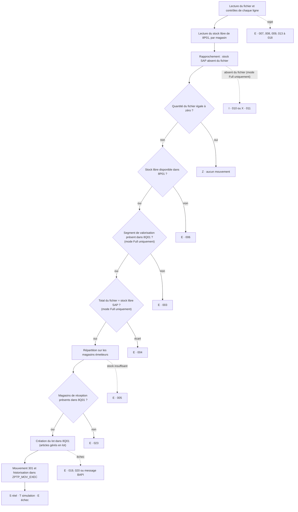

# ZPTP_SPLIT_VAL_MIG — Spécification fonctionnelle et guide d'utilisation

01/10/2026 · programme v0.5 (aligné sur le source)

## 1. Objet et périmètre

Le programme ZPTP_SPLIT_VAL_MIG transfère le stock libre de l'usine source 8P01 vers la nouvelle usine 8Q01, où la valorisation séparée (split valuation) est active, par un mouvement 301 (transfert d'usine à usine en une étape). Le fichier d'entrée fournit la correspondance entre article, lot et type de valorisation, ainsi que les quantités.

**Ce que fait le programme :**

- lit le stock libre de l'usine source, par magasin ;
- rapproche ce stock du fichier d'entrée et contrôle les données (segment de valorisation, quantités, unités, lots) ;
- crée les lots manquants dans l'usine cible, avec les caractéristiques du lot source ;
- poste un mouvement 301 par ligne du fichier, avec le type de valorisation cible ;
- historise chaque ligne traitée dans une table de log et affiche le résultat dans une liste ALV.

**Articles traités :** articles gérés en lot et articles non gérés en lot.

**Hors périmètre :**

- stock en contrôle qualité, stock bloqué et stocks spéciaux : seul le stock libre est lu ;
- copie de la classification des lots : les caractéristiques de classe ne sont pas reprises ;
- valorisation au niveau société : le programme suppose une valorisation au niveau usine.

**Usage prévu :** migration ponctuelle, exécutée par l'équipe de migration, toujours d'abord en simulation puis en réel.

**Hypothèses de départ :**

- l'usine cible a les mêmes codes magasin que l'usine source, au moins pour ceux qui portent du stock ;
- les quantités du fichier sont exprimées dans l'unité de base de l'article ;
- un lot porte un seul type de valorisation.

## 2. Déroulement du traitement

Chaque ligne du fichier passe une suite de contrôles ; au premier contrôle en échec, la ligne s'arrête avec un statut et un message, et rien n'est posté pour elle. Les autres lignes continuent.



### 2.1 Préparation (une fois par exécution)

1. **Lecture du fichier.** Chaque ligne est découpée selon le séparateur. Une ligne inutilisable est rejetée et historisée en statut E : format incorrect ou numéro d'article non convertible (009), quantité non numérique (007), quantité négative (008) ou unité inconnue (017).
2. **Contrôles de ligne.** Le programme vérifie l'unité par rapport à l'unité de base (018), l'unicité du type de valorisation par lot (016) et la cohérence des déclarations NO_BATCH avec la fiche article (013, 014, 015). Les valeurs fictives de lot sont ramenées à blanc (avertissement 012).
3. **Agrégation.** Les quantités du fichier sont totalisées par article + lot, pour le contrôle de quantité.
4. **Lecture du stock SAP.** Stock libre de l'usine source par magasin : MCHB-CLABS pour les articles gérés en lot, MARD-LABST pour les autres. Un article est géré en lot si MARC-XCHPF de l'usine source ou MARA-XCHPF est coché.
5. **Rapprochement inverse.** Un article/lot en stock dans SAP mais absent du fichier est signalé : statut I (010) si un segment de valorisation existe déjà dans l'usine cible, statut X (011) sinon. Il n'est pas transféré. Ce contrôle ne s'exécute qu'en mode Full Validation et il est sauté lors d'une reprise des erreurs. Le stock d'un article ou d'un lot déjà bloqué par un contrôle de ligne n'est pas signalé une seconde fois.

### 2.2 Traitement de chaque ligne

1. **Quantité nulle** : statut Z, aucun mouvement.
2. **Stock libre** : sans stock libre pour l'article/lot dans l'usine source, statut E (006).
3. **Segment de valorisation** (mode Full uniquement) : le type de valorisation du fichier doit exister dans l'usine cible (MBEW), sinon E (003).
4. **Quantité** (mode Full uniquement) : le total du fichier par article + lot doit égaler le stock libre SAP, au millième près, sinon E (004).
5. **Répartition sur les magasins** : la quantité est prélevée sur les magasins qui portent le stock, le plus gros d'abord. Si le stock restant ne couvre pas la ligne, E (005) ; aucune sortie partielle n'est faite.
6. **Magasins de réception** : chaque magasin émetteur doit exister avec le même code dans l'usine cible (T001L), sinon E (023).
7. **Création du lot** (articles gérés en lot) : si le lot n'existe pas dans l'usine cible, il est créé avec les attributs du lot source et le type de valorisation cible. Un lot déjà présent avec un autre type de valorisation bloque la ligne (019). En simulation, le lot n'est pas créé.
8. **Mouvement 301** : un document article par ligne du fichier, un poste par magasin émetteur, date comptable = P_BUDAT. Le document et ses lignes de log sont validés ensemble.

Les contrôles 5 et 6 passent avant la création du lot : aucun lot n'est créé pour une ligne qui ne pourra pas être postée.

### 2.3 Modes d'exécution

| Mode | Paramètre | Contrôles 3 et 4, rapprochement inverse | Usage |
| --- | --- | --- | --- |
| Full Validation | P_FULL (défaut) | exécutés | cas standard : seules les lignes entièrement valides sont transférées |
| Direct Transfer | P_DIR | sautés | articles dont la valorisation séparée n'est pas encore active dans l'usine cible ; le 301 ne porte le type de valorisation que si l'article est valorisé séparément dans l'usine cible |

Dans les deux modes, les contrôles de ligne, le contrôle de stock libre, la répartition, le contrôle des magasins et la création des lots s'appliquent.

### 2.4 Simulation et exécution réelle

En simulation (P_TEST coché, valeur par défaut), le programme exécute tous les contrôles et appelle BAPI_GOODSMVT_CREATE en mode test, suivi d'un rollback : le mouvement est contrôlé par SAP sans aucune écriture de stock. Les lignes valides sont historisées en statut T et la colonne document article affiche SIMULATED. Les lots ne sont pas créés ; le lot source est tout de même lu, donc un lot source illisible (020) apparaît dès la simulation. Pour poster réellement, décocher P_TEST.

## 3. Écran de sélection

L'écran porte le titre **STOCKS & BATCHES MIGRATION PROGRAM** et regroupe 17 paramètres en quatre blocs. Chaque paramètre est libellé *libellé (nom technique)*, par exemple *Source plant (P_WSRC)* ; les libellés de l'écran sont en anglais. Les contrôles de cohérence ne s'exécutent qu'au lancement (F8, job d'arrière-plan, impression), pas à chaque changement de sélection. Quand l'option de suppression P_DEL est cochée, seul le RUN_ID est contrôlé.

### 3.1 Bloc « Organizational data »

| Paramètre | Libellé | Obligatoire | Défaut | Signification et fonctionnement |
| --- | --- | --- | --- | --- |
| P_WSRC | Source plant | oui | 8P01 | Usine émettrice dont le stock libre est lu et transféré. Doit exister dans T001W et être différente de l'usine cible. |
| P_WDST | Target plant | oui | 8Q01 | Usine réceptrice, où la valorisation séparée est active. Doit exister dans T001W. Les segments de valorisation, les lots et les magasins sont contrôlés dans cette usine. |
| P_LGDST | Receiving SLoc | non | vide | Magasin de réception, contrôlé dans T001L pour l'usine cible s'il est saisi. **N'est pas utilisé pour le mouvement** : chaque poste est reçu dans le magasin de même code que le magasin émetteur. |
| S_MATNR | Material | non | vide | Restreint le traitement à certains articles, à la fois dans le stock lu et dans le fichier. |
| S_CHARG | Batch | non | vide | Restreint le traitement à certains lots, dans le stock et dans le fichier. |
| S_MTART | Material type | non | vide | Restreint le traitement à certains types d'article (MARA-MTART). Un article exclu par ce filtre est ignoré sans message. |
| P_BUDAT | Posting date | oui au lancement | date du jour | Date comptable des mouvements 301. Contrôlée aussi en arrière-plan. |

Avec l'un des trois filtres S_MATNR, S_CHARG ou S_MTART, le rapprochement « stock SAP absent du fichier » ne couvre que le périmètre filtré. Pour un rapprochement complet, lancer sans filtre.

### 3.2 Bloc « Input file »

| Paramètre | Libellé | Obligatoire | Défaut | Signification et fonctionnement |
| --- | --- | --- | --- | --- |
| P_SRV | Application server | choix exclusif | coché | Le fichier est lu sur le serveur d'application. Seul choix possible en arrière-plan. |
| P_LOC | Local file | choix exclusif | — | Le fichier est chargé depuis le poste de travail (GUI). Nécessite une exécution en dialogue. |
| P_FILE | Input file path | oui | vide | Chemin complet du fichier. L'aide F4 ouvre l'explorateur du serveur ou du poste selon le choix ci-dessus. Le programme vérifie que le fichier existe et est lisible avant de démarrer. |
| P_SEP | Field separator | oui | ; | Caractère séparateur des colonnes du fichier. |

### 3.3 Bloc « Run control »

| Paramètre | Libellé | Obligatoire | Défaut | Signification et fonctionnement |
| --- | --- | --- | --- | --- |
| P_RUNID | Run ID, blank=new | non | vide | Identifiant d'exécution. Vide : un nouvel identifiant HBM + date + heure est créé. Saisi : l'exécution est rattachée à ce RUN_ID avec la séquence suivante (001, 002, …). Obligatoire avec P_REPRC et P_DEL. |
| P_REPRC | Reprocess errors | non | non coché | Ne retraite que les lignes en statut E de la séquence précédente du RUN_ID. Exige un RUN_ID existant dans ZPTP_MOV_EXEC. |
| P_FULL | Full validation | choix exclusif | coché | Mode standard : tous les contrôles s'appliquent (voir 2.3). |
| P_DIR | Direct transfer | choix exclusif | — | Saute le contrôle du segment de valorisation, le contrôle de quantité et le rapprochement inverse (voir 2.3). |
| P_TEST | Simulation | non | coché | Coché : simulation, aucune écriture de stock ni création de lot. Décoché : exécution réelle. |

### 3.4 Bloc « Maintenance »

| Paramètre | Libellé | Obligatoire | Défaut | Signification et fonctionnement |
| --- | --- | --- | --- | --- |
| P_DEL | Delete run ID | non | non coché | Supprime les lignes du RUN_ID saisi dans les deux tables de log, après confirmation. Aucun autre traitement n'est exécuté. Voir la section 6. |

## 4. Format du fichier d'entrée

Le fichier est un fichier texte à plat, avec une ligne par combinaison article / lot / type de valorisation et cinq colonnes dans un ordre fixe.

### 4.1 Colonnes

| Position | Colonne | Obligatoire | Contenu et règles |
| --- | --- | --- | --- |
| 1 | MATNR | oui | Numéro d'article, avec ou sans zéros de tête (conversion standard SAP). Vide : ligne rejetée (009). |
| 2 | CHARG | non | Numéro de lot pour un article géré en lot. Pour un article non géré en lot : vide ou NO_BATCH (voir 4.3). |
| 3 | BWTAR | oui | Type de valorisation cible dans l'usine 8Q01. Vide : ligne rejetée (009). |
| 4 | QUANTITY | oui | Quantité à transférer, dans l'unité de base de l'article. Non numérique : rejet (007). Négative : rejet (008). Zéro : aucun mouvement (statut Z). |
| 5 | UOM | non | Unité de mesure. Elle doit être l'unité de base de l'article (MARA-MEINS). Inconnue : rejet (017). Différente de l'unité de base : rejet (018). Vide : l'unité de base est retenue. |

Les colonnes supplémentaires après la cinquième sont ignorées. Une ligne de moins de cinq colonnes est rejetée (009), sauf la première ligne, alors considérée comme un en-tête et ignorée.

**Pas dans le fichier :** magasin, usines, type de mouvement et date comptable. Les magasins émetteurs viennent du stock SAP, les usines et la date de l'écran de sélection, et le mouvement est toujours un 301.

### 4.2 Règles de forme

| Propriété | Règle |
| --- | --- |
| Séparateur | Celui de P_SEP, par défaut `;`. Il ne doit pas apparaître dans une valeur : pas de guillemets ni d'échappement. |
| Ligne d'en-tête | Facultative. La première ligne est ignorée si sa 4e colonne n'est pas numérique ou si elle compte moins de cinq colonnes. |
| Lignes vides | Ignorées, à tout endroit du fichier. |
| Décimales | Point ou virgule acceptés. Aucun séparateur de milliers. |
| Espaces et casse | Les espaces autour des valeurs sont supprimés. Lot, type de valorisation et unité sont convertis en majuscules. |
| Encodage | Page de code par défaut du serveur d'application, sans BOM. |
| Fins de ligne | Celles du serveur d'application : transférer le fichier en mode texte, sinon un retour chariot parasite se retrouve dans l'unité. |

### 4.3 Colonne lot

| Valeur | Interprétation | Message |
| --- | --- | --- |
| Numéro de lot | Article géré en lot : lot à transférer et à créer au besoin dans l'usine cible. | — |
| NO_BATCH (ou NOBATCH, NO-BATCH, NO BATCH, sans distinction de casse) | Déclaration : l'article n'est géré en lot ni dans l'usine source ni dans l'usine cible. Aucun lot n'est créé ; le 301 ne porte que le type de valorisation. | aucun ; blocage si la fiche article contredit la déclaration (013, 014, 015) |
| Vide | Article non géré en lot : transféré sans lot. Contrairement à NO_BATCH, une valeur vide n'est pas contrôlée par rapport à la fiche article ; sur un article géré en lot, elle ne trouve aucun stock. | aucun ; 006 sur un article géré en lot |
| N/A, NA, NONE, NULL, -, --, #, . | Valeur fictive, ramenée à vide. | avertissement 012 |
| Toute autre valeur sur un article non géré en lot | Ramenée à vide. | avertissement 012 |

Un lot ne peut porter qu'un seul type de valorisation. Un lot présent sur plusieurs lignes avec des types de valorisation différents est rejeté (016) ; les lignes à quantité nulle ne sont pas comptées.

### 4.4 Exemple

```csv
MATNR;CHARG;BWTAR;QUANTITY;UOM
100234;0000004711;VT01;150,000;KG
100234;0000004712;VT02;80,000;KG
200987;NO_BATCH;VT01;1250,000;PC
300555;;VT02;0,000;L
```

- Ligne 1 : en-tête, ignorée.
- Lignes 2 et 3 : deux lots du même article, chacun avec son type de valorisation.
- Ligne 4 : article non géré en lot, déclaré NO_BATCH.
- Ligne 5 : lot vide et quantité nulle, statut Z, aucun mouvement.

### 4.5 Contrôle de quantité

En mode Full Validation, la somme des quantités du fichier pour un même article + lot doit être égale au stock libre SAP de l'usine source, tous magasins confondus, au millième près. Le fichier doit donc reprendre la totalité du stock libre de chaque article/lot, répartie entre les types de valorisation.

## 5. Résultats

À la fin de l'exécution, le programme affiche une liste ALV avec une ligne par ligne traitée et par magasin émetteur. Les mêmes lignes sont historisées dans la table ZPTP_MOV_EXEC.

### 5.1 Statuts

| Statut | Signification | Mouvement posté |
| --- | --- | --- |
| S | Succès : mouvement 301 posté, numéro de document renseigné | oui |
| T | Simulation : la ligne aurait été postée | non |
| Z | Quantité nulle dans le fichier | non |
| E | Erreur : ligne rejetée ou bloquée, voir le message | non |
| W | Avertissement | selon la ligne |
| I | Incohérence : stock SAP absent du fichier alors qu'un segment de valorisation existe dans l'usine cible | non |
| X | Stock SAP absent du fichier, sans segment dans l'usine cible : non traité | non |

### 5.2 Liste ALV

Colonnes affichées : statut, article, lot, indicateur de gestion en lot, type de valorisation, usine et magasin émetteurs, usine et magasin récepteurs, quantité postée, unité, quantité du fichier, stock SAP, écart, document article et exercice, classe et numéro de message, texte du message, RUN_ID, séquence, mode et indicateur de simulation.

### 5.3 Tables de log

| Table | Contenu | Clé |
| --- | --- | --- |
| ZPTP_MOV_EXEC | Une ligne par ligne traitée et par magasin émetteur : contexte d'exécution, article, lot, usines, magasins, type de valorisation, quantités, date comptable, document article, statut et message | RUN_ID, RUN_SEQ, POSNR |
| ZPTP_BATCH_EXT | Une ligne par lot traité dans l'usine cible : créé, déjà existant, simulé ou en erreur | RUN_ID, RUN_SEQ, MATNR, CHARG, WERKS_DST |

Chaque document article est validé dans la même unité de traitement que ses lignes de log : un document posté a toujours sa trace. Si la mise à jour échoue après validation, la ligne est repassée en statut E (022).

### 5.4 Messages (classe ZPTP_SPLIT_VAL)

| N° | Message | Statut |
| --- | --- | --- |
| 002 | Quantité nulle dans le fichier, aucun mouvement | Z |
| 003 | Type de valorisation absent de l'usine cible | E |
| 004 | Écart entre la quantité du fichier et le stock SAP | E |
| 005 | Stock insuffisant sur les magasins émetteurs | E |
| 006 | Aucun stock libre dans l'usine source pour l'article/lot | E |
| 007 | Quantité non numérique, ligne rejetée | E |
| 008 | Quantité négative, ligne rejetée | E |
| 009 | Erreur de format (nombre de colonnes, champ obligatoire vide) | E |
| 010 | Stock SAP absent du fichier, segment existant dans l'usine cible | I |
| 011 | Stock SAP absent du fichier, sans segment cible, non traité | X |
| 012 | Colonne lot ramenée à vide (valeur fictive ou article non géré en lot) | W |
| 013 | Article géré en lot mais déclaré NO_BATCH | E |
| 014 | Article non étendu à l'une des usines | E |
| 015 | Article déclaré NO_BATCH mais stock en lot dans l'usine source | E |
| 016 | Lot réparti sur plusieurs types de valorisation | E |
| 017 | Unité de mesure inconnue | E |
| 018 | Unité différente de l'unité de base de l'article | E |
| 019 | Lot déjà présent dans l'usine cible avec un autre type de valorisation | E |
| 020 | Lot source illisible dans l'usine source | E |
| 022 | Mise à jour échouée après validation, document non posté | E |
| 023 | Magasin absent de l'usine cible | E |

Les erreurs renvoyées par les BAPI SAP (création de lot, mouvement) sont reprises avec leur propre classe et numéro de message.

## 6. Reprise, maintenance et points ouverts

### 6.1 Reprise des erreurs

Chaque exécution porte un RUN_ID et une séquence (001, 002, …) calculée automatiquement. L'historique complet est conservé.

Démarche recommandée :

1. Lancer une simulation sur le fichier complet et analyser les lignes en E.
2. Corriger les données (fichier, fiche article, segments, magasins de l'usine cible).
3. Relancer en simulation jusqu'à ne plus avoir d'erreur bloquante.
4. Lancer l'exécution réelle (P_TEST décoché).
5. Pour les lignes restées en E : saisir le RUN_ID, cocher P_REPRC et relancer. Seules les lignes en E de la séquence précédente sont retraitées.

Les lignes en statut I ne se reprennent pas ainsi : elles sont absentes du fichier et n'ont pas de type de valorisation. Il faut compléter le fichier et relancer une exécution complète. Le programme affiche un message d'information quand la séquence précédente contient des lignes I.

### 6.2 Suppression d'un RUN_ID

P_DEL coché avec un RUN_ID supprime les lignes de ce RUN_ID dans ZPTP_MOV_EXEC et ZPTP_BATCH_EXT, après une fenêtre de confirmation. Aucun stock ni aucune donnée standard SAP n'est modifié.

La suppression est refusée si le RUN_ID contient des documents réellement postés (statut S hors simulation) : le log des mouvements réels sert de piste d'audit. Elle exige l'autorisation S_TABU_NAM (activité 02, table ZPTP_MOV_EXEC).

### 6.3 Autorisations

- Mouvements et création de lots : contrôles standard des BAPI SAP (BAPI_GOODSMVT_CREATE, BAPI_BATCH_CREATE).
- Suppression d'un RUN_ID : S_TABU_NAM.
- Aucun contrôle d'autorisation propre au programme n'est encore en place au lancement.

### 6.4 Points à confirmer

- [ ] Règle de répartition sur les magasins : le plus gros d'abord (en place) ou au prorata.
- [ ] Valorisation au niveau usine (MBEW-BWKEY = usine cible) : à confirmer pour le système HBM.
- [ ] Usine 8Q01 créée avec les mêmes magasins que 8P01, au moins ceux qui portent du stock.
- [ ] Traitement d'un lot réparti sur plusieurs types de valorisation : correction du fichier ou nouveaux numéros de lot.
- [ ] Liste des valeurs fictives de la colonne lot, à vérifier sur l'extraction HBM réelle.
- [ ] Indicateur de gestion en lot réellement tenu par HBM : MARC-XCHPF, MARA-XCHPF ou les deux.
- [ ] Reprise de la classification des lots, non copiée à ce stade.
- [ ] Contrôle d'autorisation au lancement, à définir avec l'équipe sécurité.
